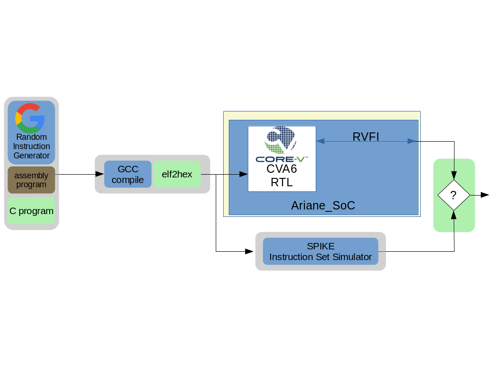

..
   Copyright (c) 2020 OpenHW Group
   
   Licensed under the Solderpad Hardware Licence, Version 2.0 (the "License");
   you may not use this file except in compliance with the License.
   You may obtain a copy of the License at
  
   https://solderpad.org/licenses/
  
   Unless required by applicable law or agreed to in writing, software
   distributed under the License is distributed on an "AS IS" BASIS,
   WITHOUT WARRANTIES OR CONDITIONS OF ANY KIND, either express or implied.
   See the License for the specific language governing permissions and
   limitations under the License.
  
   SPDX-License-Identifier: Apache-2.0 WITH SHL-2.0

.. _cva6_env:

CVA6 Simulation Testbench and Environment
==========================================

CVA6 verification is based on a UVM environment using an Instruction Set Simulator (ISS)
to validate the correct behavior of the core.

The UVM environment uses the Google random-instruction
generator for stimulus creation and the `SPIKE instruction set simulator <https://github.com/riscv-software-src/riscv-isa-sim>`__
(ISS) for results prediction. It is also capable running hand-coded
code-segments (test-programs) such as those developed by the RISC-V Compliance
Task Group.

The end-goal is to have a single UVM-based verification environment
capable of "industrial grade" verification of the CORE-V family of cores,
starting with the CV32E40P and the CV32E4* cores.
This environment is always evolving to meet the needs of current and future cores.

The CVA6 UVM Verification Environment
---------------------------------------

This sub-section discusses the structure and development of the UVM
verification environment for CVA6. This
environment is intended to be able to verify all the configurations of CVA6.

Environment description
~~~~~~~~~~~~~~~~~~~~~~~

The UVM environmnent is shown in `Illustration 1`_.

   Illustration 1: Verification Environment for CVA6

Installation
------------

The CVA6 test environment is developed on the cva6/dev branch of the core-v-verif repository.

1. git clone the `core-v-verif repository <https://github.com/openhwgroup/core-v-verif.git>`__
2. switch to the cva6/dev branch : git checkout cva6/dev
3. install the python requirements : pip3 install -r bin/requirements.txt ( need to remove dv from the requirements)

Depending on each test needs, installation scripts of dependencies are offered in the cva6/regress directory :
- install-cva6.sh : Install the CVA6 RTL
- install-riscv-compliance.sh : install the RISCV compliance tests from the RISCV Architecture Test SIG
- install-riscv-dv.sh : install the Chips Alliance RISCV DV random instruction generator
- install-riscv-tests.sh : install a set of RISCV unit tests
- install-spike.sh : install SPIKE, a RISCV instruction set simulator : https://github.com/riscv-software-src/riscv-isa-sim
- install-verilator.sh : install the verilog/systemverilog simulator Verilator

Launching tests
---------------

Multiple tests and benchmarks are already provided as bash scripts in cva6/regress. These include both the necessary installation scripts and the test(s) themselves. To launch custom tests reusing the same environment it is necessary to use the the python script cva6/sim/cva6.py.

cva6.py
~~~~~~~

cva6.py is the main script to run a simulation. The options are as follows :

* \- testlist : path to the yaml file giving the description of the test. Paths to the assembly or C code of the test is included in this yaml file.
* \- target (default : rv32imc) : the cva6 configuration tested (for example cv64a6_imafdc_sv39)
* \- iss_yaml : the configuration file describing RTL file locations and simulator options. Use cva6.yaml as the default
* \- iss : the selected simulator. Possible to pass 1 or 2 values, separated by a comma. If 2 simulators are given, trigger the comparison mechanism of the traces. Note that veri-testharness is the simulation of the CVA6 in the Ariane SoC with verilator.
* \-- output : output directory name
* \-- linker : the linker script to be used
* \-- test (default : all) : test name. all means every test in the testlist
* \-- seed ( default : -1) : randomization seed. -1 means random seed

ariane_testharness
------------------

The Ariane testharness is a small subsystem instanciating a cva6 core with a limites set of peripherals and an interconnect. For RTL simulation, the test code is preloaded in the bootrom ( the bootrom Makefile compile the code into a systemverilog component for the bootrom). The memory map of the system is defined in the ariane_soc_pkg.sv.

spike
-----
some doc here https://github.com/poweihuang17/Documentation_Spike

seems to simulate a small system with bootrom to load code

hard coded memory map

uses PK (proxy kernel) and FESVR (front-end server)

https://phdbreak99.github.io/riscv-training/12-demo.syscall/

https://riscv.org/wp-content/uploads/2015/02/riscv-software-stack-tutorial-hpca2015.pdf

https://phdbreak99.github.io/riscv-training/13-demo.verif-suite/
